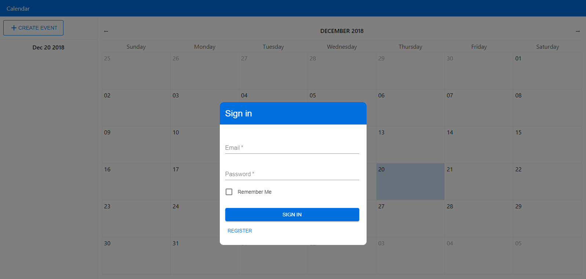

# Calendar App

This app was created using ReactJS, Express and MongoDB.

### Notes
- The MongoDB database is mocked using [Mockgoose](https://www.npmjs.com/package/mockgoose) for development purposes. To disable mocking, set `mockDatabase` to `false` and update the `dbAddr` and `dbName` fields in `./server/index.js`. These values should ideally have been set in a .env file, but to make it easier to pull and run the values were initialized within `./server/index.js`.
- The client sends requests to the server via a proxy. If running the server on a different computer, change `proxy` in `./package.json` to the address and port of the computer hosting the server. Update the `port` value in `./server/index.js` if needed.
- Due to the fact that the calendar application won't be added onto, most of the components were thrown into the main `App.js` file.
- Past days with events show the number of events in a red box. These events can be viewed on the sidebar by clicking on a past day.

### Running the app
1. Run `npm install` to install all dependencies
2. Start the server by running `node server`
3. Start the react application by running `npm start`
4. Navigate to localhost:3000

